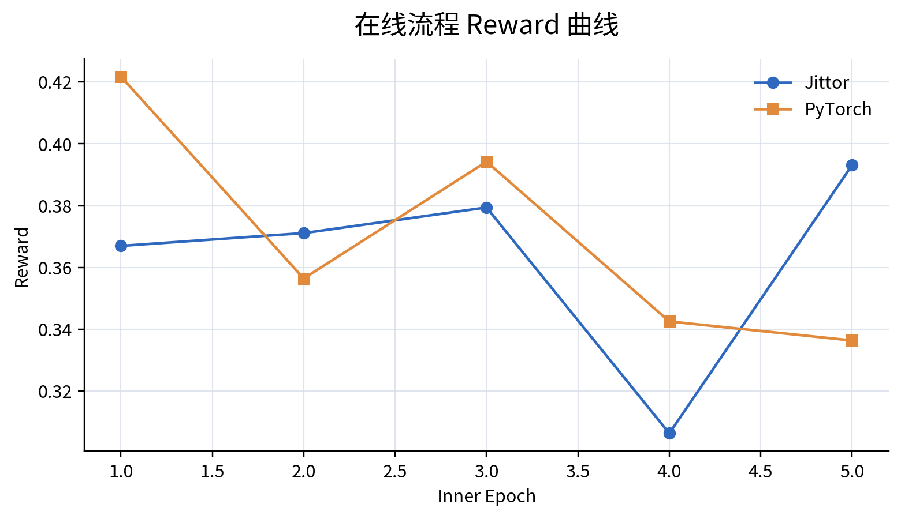
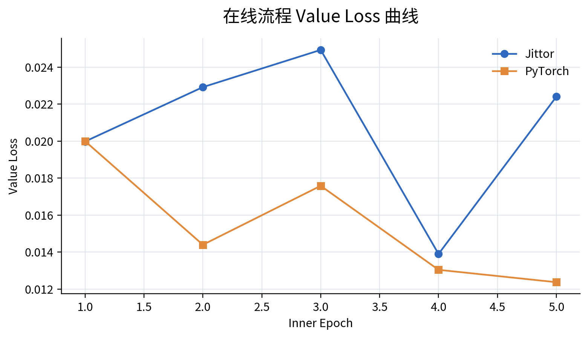
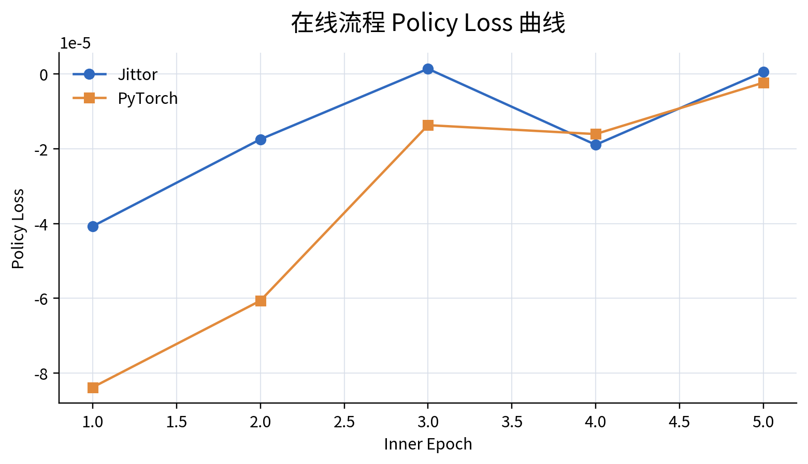
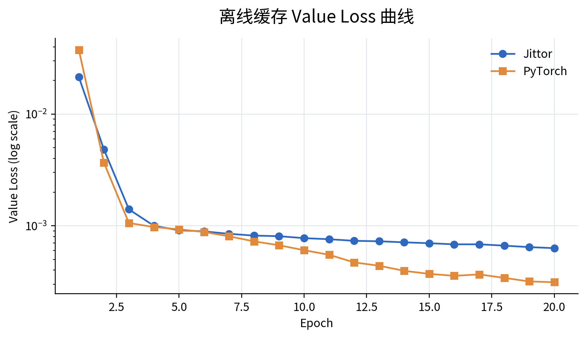
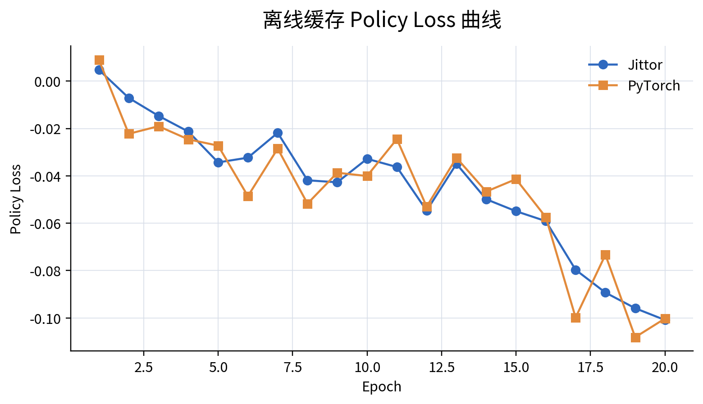
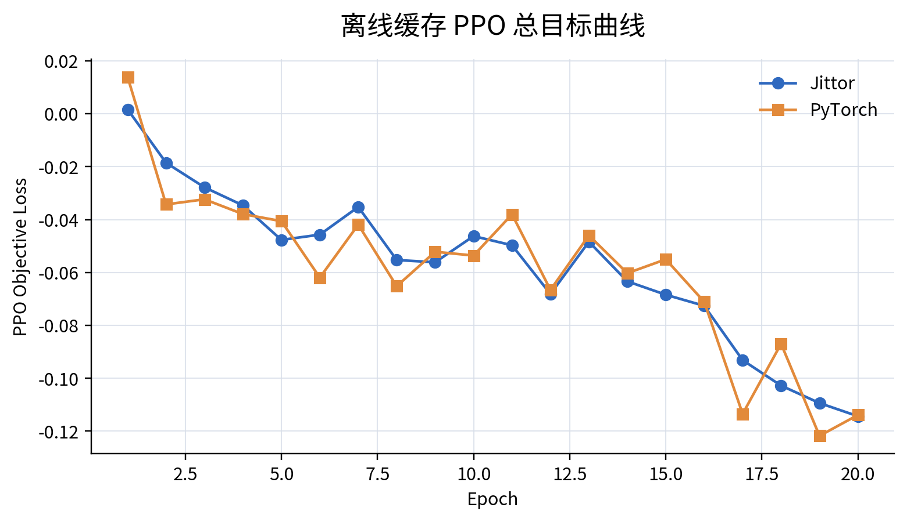
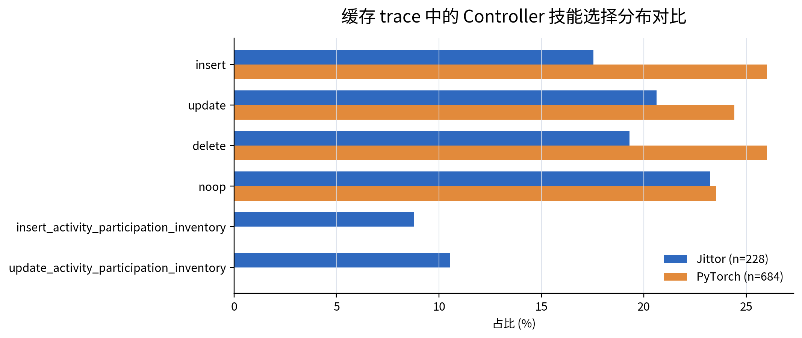
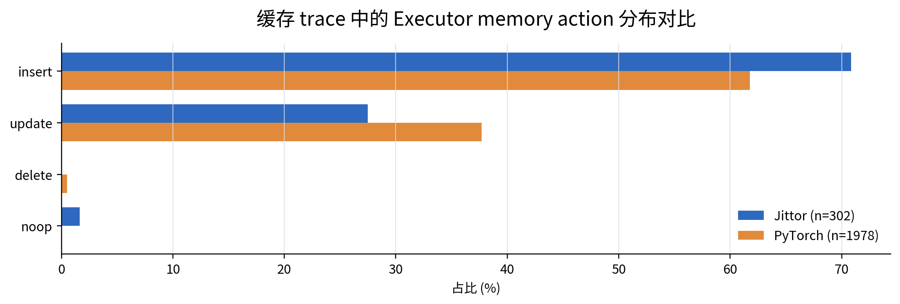
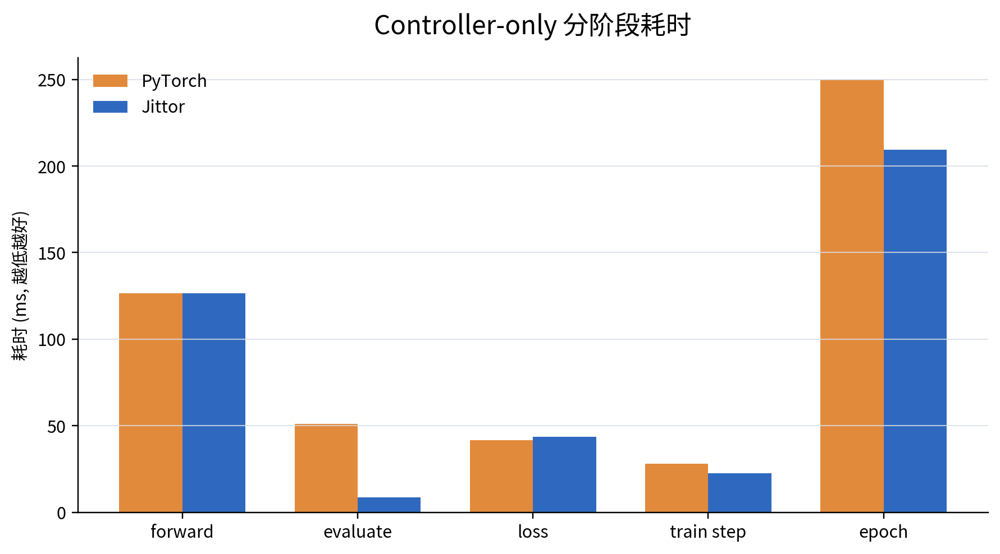
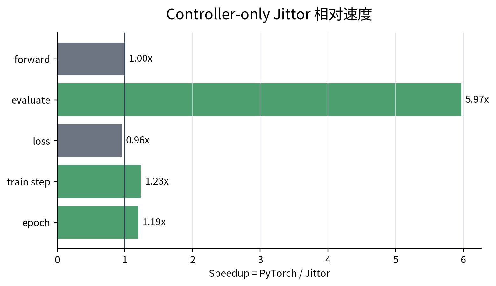

# MemSkillJittor

本仓库用于新芽计划第三阶段汇报：基于 **Jittor** 复现论文 **MemSkill: Learning and Evolving Memory Skills for Self-Evolving Agents** 中的可训练 Controller 模块，并将其接回原 MemSkill 的在线记忆构建流程。

> 说明：本仓库重点复现的是 Controller 的神经网络与 PPO 训练路径。Executor 和 Designer 主要由 LLM 驱动，因此保留原 MemSkill 实现，通过 bridge 与 Jittor Controller 对接。

## 1. 复现范围

MemSkill 整体包含三个核心模块：

| 模块 | 原论文中的作用 |
|---|---|
| Controller | 根据当前状态从 SkillBank 中选择 Top-K memory skills，并通过 PPO 学习选择策略 |
| Executor | 根据选中的 skills 调用 LLM 生成 memory actions，并更新 MemoryBank |
| Designer | 根据失败案例调用 LLM 分析并调整 SkillBank |

本仓库重点复现 Controller 的 Jittor 训练路径；Executor 和 Designer 仍沿用原 MemSkill 流程，并通过 bridge 与 Jittor Controller 对接。

Jittor 版本实现内容包括：

- 状态编码网络
- 技能编码网络
- 策略打分网络
- 价值估计网络
- 动态 SkillBank 的 padding 与 mask
- Top-K skill action 采样
- Top-K 动作联合概率重算
- PPO clipped loss
- value loss 与 entropy 项
- Jittor optimizer 更新
- checkpoint 保存
- 与原 MemSkill 在线训练流程的 bridge 接入

## 2. 目录结构

```text
MemskillJittor/
├── README.md
├── main.py
├── src/
│   ├── controller.py
│   ├── trainer.py
│   ├── executor.py
│   ├── designer.py
│   └── data_processing/
├── jittor_controller_repro/
│   ├── models/jittor_controller.py
│   ├── adapter/
│   ├── baselines/
│   ├── data/
│   ├── tests/
│   ├── train_jittor.py
│   ├── train_torch.py
│   ├── controller_benchmark.py
│   ├── plot_logs.py
│   └── runs/
├── scripts/
│   ├── run_jittor_one_batch_debug.sh
│   ├── run_jittor_locomo_full_small_designer.sh
│   ├── run_jittor_locomo_next_outer_epoch.sh
│   ├── run_torch_locomo_full_small_designer.sh
│   └── run_torch_locomo_next_outer_epoch.sh
├── data/
│   ├── locomo10.json
│   └── locomo10_one.json
└── assets/
    └── figures/
```

## 3. 环境配置

推荐使用环境脚本创建虚拟环境：

```bash
bash scripts/setup_env.sh
```

如果需要指定虚拟环境目录或 PyTorch 版本，可以使用：

```bash
bash scripts/setup_env.sh --env .venv-memskill-jittor --device cu124
bash scripts/setup_env.sh --device cpu
```

`--device` 支持：

| 参数 | 含义 |
|---|---|
| `cu124` | 安装 PyTorch CUDA 12.4 版本 |
| `cu121` | 安装 PyTorch CUDA 12.1 版本 |
| `cpu` | 安装 PyTorch CPU 版本 |
| `skip` | 跳过 PyTorch 安装 |

脚本会完成：

- 创建 Python 虚拟环境；
- 安装 PyTorch baseline 依赖；
- 安装 Jittor；
- 安装常用训练、绘图和测试依赖；
- 生成 `.env.example`。

推荐基础环境：

```text
Python >= 3.10
Jittor >= 1.3.11
PyTorch CUDA/CPU 环境，用于原版 baseline 对齐
OpenAI-compatible API，用于在线 Executor / Designer / QA 评估
```

如果 Jittor 首次编译 CUDA kernel 时提示 `nvcc` 与系统 `gcc/g++` 版本不匹配，请安装与当前 CUDA 版本兼容的编译器，并在运行前显式指定编译器路径。例如：

```bash
export CC=/path/to/compatible/gcc
export CXX=/path/to/compatible/g++
export cc_path=/path/to/compatible/g++
export cache_name=jittor_gpu_cache
export DISABLE_MULTIPROCESSING=1
```

如果只做 CPU smoke test，可以关闭 Jittor CUDA 编译：

```bash
export nvcc_path=''
```

## 4. API 与本地模型缓存

在线 MemSkill 流程需要 LLM API。请在本地 `.env` 或脚本环境变量中配置：

```bash
MEMSKILL_MODEL=<chat-model-name>
MEMSKILL_DESIGNER_MODEL=<designer-model-name>
MEMSKILL_API_BASE=<openai-compatible-base-url>
MEMSKILL_API_KEY=<api-key>
```

不要提交真实 API Key。

如果已经提前下载好 embedding 模型，可以开启 HuggingFace / Transformers 离线模式，减少训练时的网络依赖：

```bash
export HF_HUB_OFFLINE=1
export TRANSFORMERS_OFFLINE=1
export WANDB_MODE=offline
```

## 5. 数据准备

小规模在线训练使用 LoCoMo 数据：

```text
data/locomo10.json
data/locomo10_one.json
```

其中：

- `locomo10_one.json` 用于快速调试；
- `locomo10.json` 用于小规模完整流程训练。

本项目受 API 调用成本和显存限制，目标是验证 Jittor Controller 可以跑通完整训练闭环，并与 PyTorch 原流程在训练记录和行为分布上保持相近，而不是复现论文最终大规模指标。

## 6. 训练脚本

### 6.1 Jittor 完整训练

```bash
./scripts/run_jittor_locomo_full_small_designer.sh
```

该脚本用于运行 Jittor Controller 接入后的完整 MemSkill 在线训练流程，包括 Controller 选择技能、Executor 更新 MemoryBank、任务 reward 计算、PPO 更新以及 Designer evolution。

输出目录：

```text
jittor_controller_repro/runs/locomo_jittor_full_small_designer_epochwise/
```

### 6.2 PyTorch 原版对齐训练

PyTorch baseline 使用原版 Controller，并尽量保持与 Jittor 版本一致的训练配置：

```bash
./scripts/run_torch_locomo_full_small_designer.sh
```

输出目录：

```text
jittor_controller_repro/runs/locomo_torch_full_small_designer_epochwise/
```

### 6.3 快速检查与分轮运行

如果只想快速确认 Jittor Controller 能否接入原 MemSkill 训练边界，可以运行：

```bash
./scripts/run_jittor_one_batch_debug.sh
```

如果计算资源、API 稳定性或运行时间有限，可以按 outer epoch 分轮执行：

```bash
./scripts/run_jittor_locomo_next_outer_epoch.sh 1
./scripts/run_torch_locomo_next_outer_epoch.sh 1
```

训练完成后，主要日志、曲线和行为分布会保存到对应 `runs/` 目录中，例如 `metrics.csv`、`metrics.jsonl`、`train.log`、`value_loss_curve.png`、`policy_loss_curve.png`、`selected_skill_stats.png` 和 `memory_action_stats.png`。

README 中的图表可以用已保存的日志重新生成：

```bash
python scripts/generate_readme_figures.py \
  --runs-root jittor_controller_repro/runs \
  --out-dir assets/figures
```

## 7. 测试脚本

单元测试：

```bash
pytest jittor_controller_repro/tests
```

Bridge smoke test：

```bash
python -m jittor_controller_repro.test_bridges
```

Top-K 联合概率测试：

```bash
pytest jittor_controller_repro/tests/test_topk_logprob.py
```

Jittor Controller forward 测试：

```bash
pytest jittor_controller_repro/tests/test_jittor_controller_forward.py
```

## 8. 离线 Controller 训练

在线训练会受到 API、LLM 输出和采样随机性的影响。为了更稳定地比较 PyTorch 与 Jittor Controller，可以将轨迹缓存为固定 `.npz`，再分别运行两种后端。

生成合成 trace：

```bash
python -m jittor_controller_repro.data.synthetic_generator \
  --output jittor_controller_repro/runs/synthetic_trace.npz \
  --n-steps 128 \
  --state-dim 128 \
  --op-dim 128 \
  --action-top-k 3 \
  --seed 42
```

分别训练 PyTorch 与 Jittor：

```bash
python -m jittor_controller_repro.train_torch \
  --trace jittor_controller_repro/runs/synthetic_trace.npz \
  --log jittor_controller_repro/runs/torch_train.jsonl

python -m jittor_controller_repro.train_jittor \
  --trace jittor_controller_repro/runs/synthetic_trace.npz \
  --log jittor_controller_repro/runs/jittor_train.jsonl
```

绘制 loss 曲线：

```bash
python -m jittor_controller_repro.plot_logs \
  --torch-log jittor_controller_repro/runs/torch_train.jsonl \
  --jittor-log jittor_controller_repro/runs/jittor_train.jsonl \
  --metric total_loss \
  --output jittor_controller_repro/runs/total_loss_curve.png
```

## 9. 训练曲线与对齐结果

本仓库同时保留两类实验图：

- **在线流程图**：来自真实 MemSkill 链路，包含 Controller、Executor、reward、PPO 更新和 Designer evolution，用于说明 Jittor Controller 已经接入完整训练闭环；
- **离线缓存图**：使用固定 cached trace，不重新调用 LLM API，用于减少随机性，更稳定地比较 PyTorch / Jittor 的训练趋势。

### 9.1 在线流程：完整闭环可运行

下图分别展示一轮小规模在线训练中的 reward、Value Loss 和 Policy Loss。两种后端都完成了 5 个 inner epoch，并产生了 PPO 训练信号。

在线 Reward 曲线：



在线 Value Loss 曲线：



在线 Policy Loss 曲线：



在线训练中 Executor 和 Designer 涉及 LLM 调用，因此 reward、memory action 数量和 loss 曲线不应被解读为逐点严格一致。这里重点验证的是：真实 LoCoMo 输入可以经过技能选择、记忆更新、reward 计算和 PPO 更新，形成完整训练闭环。

### 9.2 离线缓存：固定 trace 下的训练对齐

下图使用相同 cached trace 分别训练 PyTorch 与 Jittor Controller。相比在线流程，离线缓存更适合展示 loss 下降趋势和后端对齐情况。

离线 Value Loss 曲线：



离线 Policy Loss 曲线：



离线 PPO 总目标曲线：



这组结果说明：在固定输入轨迹下，Jittor Controller 的 Value Loss、Policy Loss 和 Value 拟合度与 PyTorch baseline 保持同量级，并呈现相近的训练变化趋势。

## 10. 行为分布可视化

行为分布图使用 PyTorch / Jittor 的 cached trace 记录生成，不重新调用 LLM API。由于两边 trace 记录数量不同，这里使用占比而不是原始次数，重点观察两种实现的行为分布是否处于相近范围。

Controller 技能选择分布对比：



Executor memory action 分布对比：



可以看到，Controller 会在多种候选 skill 之间进行选择；Executor 输出仍以 insert / update 为主，少量出现 delete / noop，符合 MemoryBank 构建任务的常见操作分布。

## 11. Controller-only 性能测试

端到端 MemSkill 训练包含 LLM API、Retriever、Executor 和 QA 评估，无法直接体现 Controller 模块迁移后的性能。因此我们额外做了 Controller-only benchmark，只比较：

- forward / select_action
- evaluate_actions
- compute_ppo_loss
- optimizer step

运行：

```bash
python -m jittor_controller_repro.controller_benchmark
```

### 11.1 Synthetic Trace

| Metric | PyTorch | Jittor | Jittor / PyTorch | Speedup |
|---|---:|---:|---:|---:|
| forward_sec_mean | 0.233940 | 0.226198 | 0.967 | 1.034x |
| evaluate_sec_mean | 0.070696 | 0.014009 | 0.198 | 5.046x |
| loss_sec_mean | 0.038953 | 0.040351 | 1.036 | 0.965x |
| train_step_sec_mean | 0.024638 | 0.020121 | 0.817 | 1.224x |
| epoch_sec_mean | 0.370885 | 0.307038 | 0.828 | 1.208x |

### 11.2 Real LoCoMo Cached Trace

下图展示真实 LoCoMo cached trace 上的 Controller-only benchmark。第一张图比较各阶段耗时，第二张图展示 `PyTorch / Jittor` speedup。

Controller-only 分阶段耗时：



Controller-only Jittor 相对速度：



| Metric | PyTorch | Jittor | Jittor / PyTorch | Speedup |
|---|---:|---:|---:|---:|
| forward_sec_mean | 0.126375 | 0.126555 | 1.001 | 0.999x |
| evaluate_sec_mean | 0.051021 | 0.008546 | 0.168 | 5.970x |
| loss_sec_mean | 0.041755 | 0.043633 | 1.045 | 0.957x |
| train_step_sec_mean | 0.027974 | 0.022659 | 0.810 | 1.235x |
| epoch_sec_mean | 0.249953 | 0.209275 | 0.837 | 1.194x |

结论：

- Jittor 在 `evaluate_actions` 阶段表现出明显优势；
- 真实 LoCoMo cached trace 上，Controller-only 单 epoch 约 `1.19x`；
- 端到端在线训练受 API 和 LLM 调用影响较大，因此整体加速不明显，优势主要体现在 Controller 局部计算。

## 12. 实现细节

### 12.1 动态 SkillBank

训练过程中 SkillBank 数量会变化。Jittor Controller 会将候选 skill embedding padding 成规则 batch tensor，并用 mask 避免 padding 位置参与 softmax 和 PPO 概率计算。

### 12.2 Top-K 联合概率

Top-K skills 组成一个有顺序的动作。PPO 更新阶段需要在新策略下重新计算同一组 Top-K skills 的联合概率。

Jittor 版本将部分前缀概率计算改写为 `jt.cumsum`，减少 Python 循环，并让概率计算保持在 Jittor 张量化路径中。

### 12.3 为什么不把 Executor 和 Designer 改成 Jittor

Executor 和 Designer 主要是 LLM 驱动：

- Executor 根据选中的 skill 生成具体 memory action；
- Designer 根据 hard cases 反思并修改或新增 skill。

这两个模块不是主要的可训练神经网络路径。因此，本次复现重点放在 Controller，而不是将所有流程都改写成 Jittor。

## 13. 当前局限

- 当前实验使用 LoCoMo 小规模设置，受 API 成本和显存限制，没有复现论文最终大规模指标；
- 在线训练结果会受到 LLM 输出、API 延迟和采样随机性的影响；
- 端到端加速并不明显，性能优势主要体现在 Controller 局部计算；
- README 中的曲线和日志用于说明功能对齐、训练信号和性能趋势，不应解读为 Jittor 版本全面优于 PyTorch。

## 14. 提交检查清单

- [x] 环境配置说明
- [x] 数据准备说明
- [x] Jittor 训练脚本说明
- [x] PyTorch baseline 脚本说明
- [x] 测试脚本说明
- [x] 训练日志说明
- [x] loss 曲线展示
- [x] PyTorch / Jittor 对齐结果
- [x] 性能测试结果
- [x] 当前局限说明

## 15. 致谢

本仓库基于原 MemSkill 实现进行课程复现，重点补充 Jittor Controller、训练脚本、测试脚本、实验日志和可视化结果。
