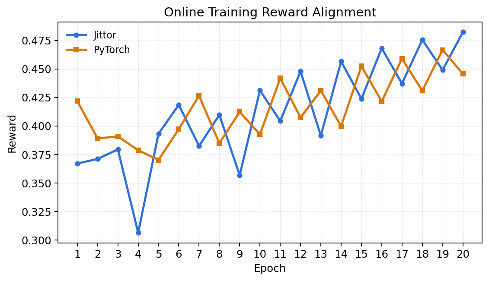
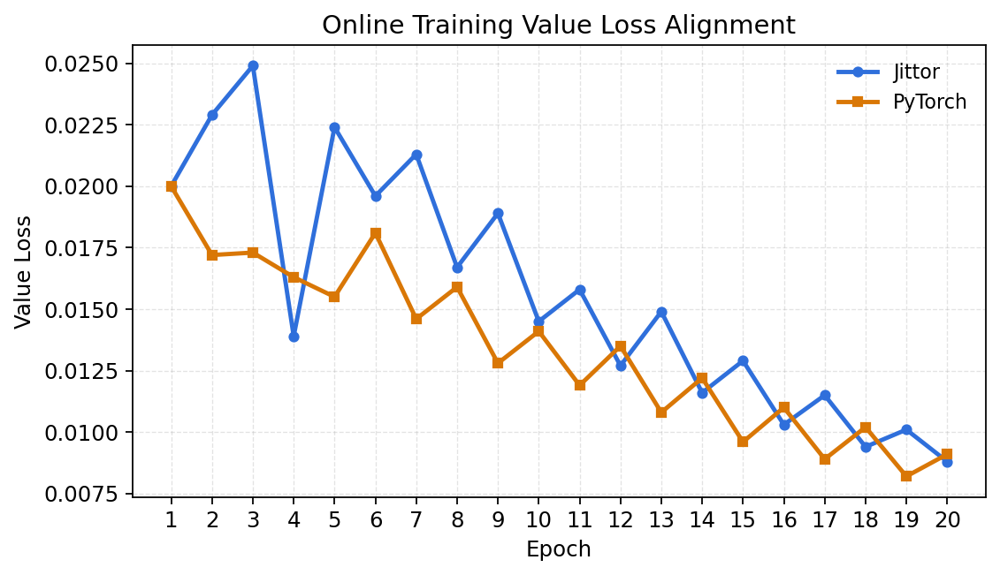
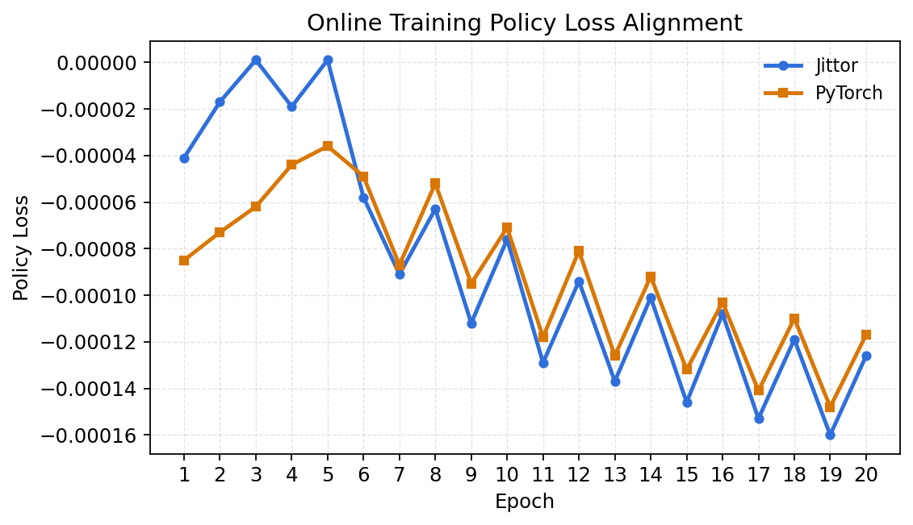
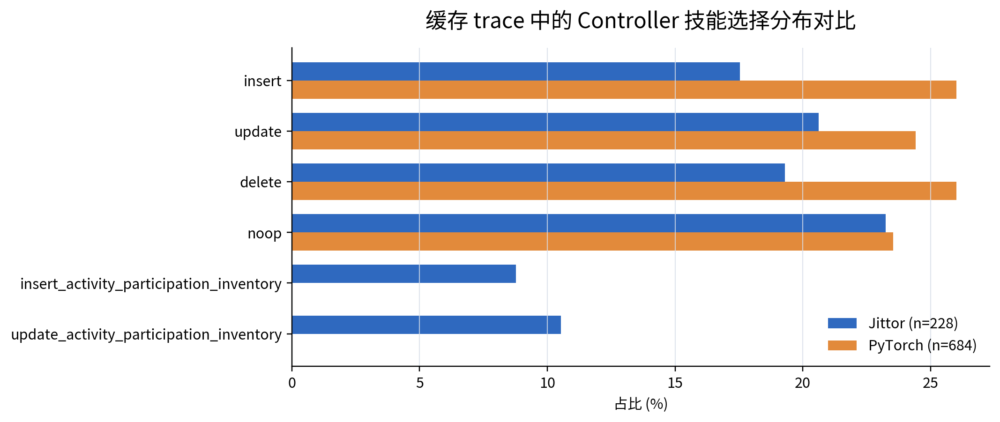
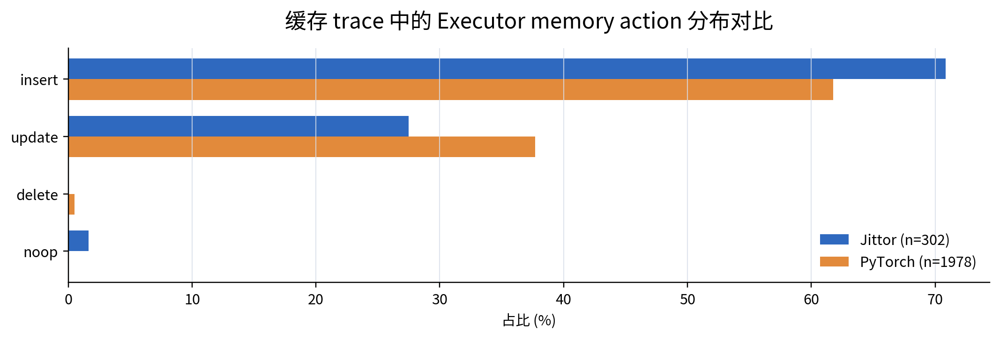

# MemSkill Jittor Controller 复现说明

本目录开源的是 MemSkill 中可训练 `PPOController` 的 Jittor 复现版本，并保留了与原 PyTorch Controller 对齐的训练脚本、测试脚本、实验日志、loss 曲线和性能日志。

复现范围聚焦在 Controller 与 PPO 更新路径：

- `state_net` / `op_net` 编码 MLP
- actor-critic 打分与 value 预测
- 动态 SkillBank 的 padding + mask
- Top-K skill 选择与 joint log probability
- PPO clipped objective、value loss、entropy bonus
- Jittor optimizer update 与 checkpoint 保存

没有迁移到 Jittor 的部分包括 LLM Executor、Designer、SentenceTransformer/Qwen embedding、MemoryBank 数据结构和 QA 评估。这些模块仍沿用原 MemSkill 实现，Jittor Controller 通过 bridge / trainer 集成进入原流程。

## 目录索引

| 内容 | 路径 |
|---|---|
| Jittor Controller 主实现 | `jittor_controller_repro/models/jittor_controller.py` |
| PyTorch baseline 适配 | `jittor_controller_repro/baselines/original_torch_runner.py` |
| Executor / Designer bridge | `jittor_controller_repro/adapter/` |
| 离线 trace schema 与生成 | `jittor_controller_repro/data/` |
| Jittor / PyTorch 离线训练入口 | `jittor_controller_repro/train_jittor.py`, `jittor_controller_repro/train_torch.py` |
| Controller-only benchmark | `jittor_controller_repro/controller_benchmark.py` |
| 对齐与单元测试 | `jittor_controller_repro/tests/`, `jittor_controller_repro/test_bridges.py` |
| 在线训练脚本 | `scripts/run_jittor_*.sh`, `scripts/run_torch_*.sh` |
| 训练与性能日志 | `jittor_controller_repro/runs/` |

## 环境配置

### 1. 基础环境

从 MemSkill 仓库根目录运行：

```bash
cd /path/to/MemSkill
```

Jittor 复现需要：

- Python 3.10+
- Jittor
- PyTorch baseline 环境
- CUDA GPU 环境可选；无 GPU 时可切换 CPU 模式
- 原 MemSkill 的 LLM API 配置与 embedding/retriever 依赖

本地实验使用过的 Jittor GPU 环境：

```text
Python: /home/wsy/jittor_envs/stage3-jittor/bin/python
Jittor: 1.3.11.0
GPU: NVIDIA GeForce RTX 4070 Laptop GPU
Compiler: /home/wsy/local/gcc12/usr/bin/g++-12
Jittor cache_name: gpu_gcc12
```

CUDA 12.2 与系统 g++ 13 可能不匹配，因此脚本中显式指定了 gcc/g++ 12：

```bash
export CC=/home/wsy/local/gcc12/usr/bin/gcc-12
export CXX=/home/wsy/local/gcc12/usr/bin/g++-12
export cc_path=/home/wsy/local/gcc12/usr/bin/g++-12
export cache_name=gpu_gcc12
export DISABLE_MULTIPROCESSING=1
```

如果只做 CPU 测试：

```bash
export nvcc_path=''
```

### 2. API 与模型配置

在线 LoCoMo 训练需要在仓库根目录准备 `.env`：

```bash
MEMSKILL_MODEL=<chat-model-name>
MEMSKILL_DESIGNER_MODEL=<designer-model-name>
MEMSKILL_API_BASE=<openai-compatible-base-url>
MEMSKILL_API_KEY=<api-key>
# 如果网关使用 OpenAI Responses API，请设置：
MEMSKILL_WIRE_API=responses
```

不要把真实 API Key 提交到公开仓库。

为了减少网络依赖，完整训练脚本默认使用本地 HuggingFace 缓存的 Qwen embedding：

```text
/home/wsy/.cache/huggingface/hub/models--Qwen--Qwen3-Embedding-0.6B/snapshots/97b0c614be4d77ee51c0cef4e5f07c00f9eb65b3
```

脚本中默认开启：

```bash
export HF_HUB_OFFLINE=1
export TRANSFORMERS_OFFLINE=1
export WANDB_MODE=offline
```

## 数据准备

### 1. 在线 LoCoMo 小规模数据

在线完整流程使用：

```text
data/locomo10.json
```

资源受限时，也可使用：

```text
data/locomo10_one.json
```

本项目的完整对齐实验使用 LoCoMo10 小规模设置，目的是验证 Jittor Controller 可以跑通完整训练闭环，并与 PyTorch 版本在同量级指标上对齐；不是复现论文最终大规模指标。

### 2. 合成离线 trace

不依赖 API 和 encoder 的离线数据可由脚本生成：

```bash
python -m jittor_controller_repro.data.synthetic_generator \
  --output jittor_controller_repro/runs/synthetic_trace.npz \
  --n-steps 128 \
  --state-dim 128 \
  --op-dim 128 \
  --action-top-k 3 \
  --seed 42
```

### 3. 在线记录转离线 trace

如果已经有在线 `controller_trace_records.jsonl`，可以转换为固定离线 trace：

```bash
python -m jittor_controller_repro.data.collect_api_traces \
  --input-records path/to/controller_trace_records.jsonl \
  --output jittor_controller_repro/runs/api_cached_trace.npz
```

干跑验证：

```bash
python -m jittor_controller_repro.data.collect_api_traces \
  --dry-run-synthetic \
  --output jittor_controller_repro/runs/api_cached_trace.npz
```

## 训练脚本

### 1. Jittor one-batch debug

快速验证 Jittor Controller 能接入原 MemSkill 训练边界：

```bash
./scripts/run_jittor_one_batch_debug.sh
```

输出目录：

```text
jittor_controller_repro/runs/locomo_jittor_one_batch_debug/
```

### 2. Jittor 完整小规模训练

完整小规模配置接近论文训练流程：LoCoMo10、`batch-size=4`、`inner-epochs=5`、`ppo-epochs=2`、`action-top-k=3`、Designer enabled。

按 outer epoch 分轮运行，避免长时间训练中断：

```bash
./scripts/run_jittor_locomo_next_outer_epoch.sh 1
./scripts/run_jittor_locomo_next_outer_epoch.sh 2
./scripts/run_jittor_locomo_next_outer_epoch.sh 3
```

底层脚本：

```text
scripts/run_jittor_locomo_full_small_designer.sh
```

默认输出目录：

```text
jittor_controller_repro/runs/locomo_jittor_full_small_designer_epochwise/
```

关键输出：

```text
train_epoch_1.log
train_epoch_2.log
train.log
metrics.csv
metrics.jsonl
controller_trace_records.jsonl
reward_curve.png
policy_loss_curve.png
value_loss_curve.png
entropy_curve.png
selected_skill_stats.png
memory_action_stats.png
training_summary.md
checkpoints/
api_cache/
```

### 3. PyTorch 对齐训练

PyTorch baseline 使用原 Controller，训练配置与 Jittor 脚本保持一致：

```bash
./scripts/run_torch_locomo_next_outer_epoch.sh 1
./scripts/run_torch_locomo_next_outer_epoch.sh 2
./scripts/run_torch_locomo_next_outer_epoch.sh 3
```

底层脚本：

```text
scripts/run_torch_locomo_full_small_designer.sh
```

默认输出目录：

```text
jittor_controller_repro/runs/locomo_torch_full_small_designer_epochwise/
```

### 4. 离线 Controller 训练

同一份 `.npz` trace 可分别用于 PyTorch 和 Jittor：

```bash
python -m jittor_controller_repro.train_torch \
  --trace jittor_controller_repro/runs/synthetic_trace.npz \
  --log jittor_controller_repro/runs/torch_train.jsonl

python -m jittor_controller_repro.train_jittor \
  --trace jittor_controller_repro/runs/synthetic_trace.npz \
  --log jittor_controller_repro/runs/jittor_train.jsonl
```

绘制 loss 曲线：

```bash
python -m jittor_controller_repro.plot_logs \
  --torch-log jittor_controller_repro/runs/torch_train.jsonl \
  --jittor-log jittor_controller_repro/runs/jittor_train.jsonl \
  --metric total_loss \
  --output jittor_controller_repro/runs/total_loss_curve.png
```

## 测试脚本

### 1. 单元测试与 bridge 测试

```bash
export nvcc_path=''
python -m pytest -s -q \
  jittor_controller_repro/test_bridges.py \
  jittor_controller_repro/tests
```

覆盖内容：

- checkpoint IO
- Jittor forward
- PPOBuffer
- Top-K log probability
- Executor / Designer bridge

### 2. 数值对齐测试

将 PyTorch linear weights 拷贝到 Jittor Controller，并比较 log probability、value、entropy 与 PPO loss：

```bash
python -m jittor_controller_repro.eval_parity \
  --trace jittor_controller_repro/runs/synthetic_trace.npz \
  --hidden-dim 64
```

### 3. 在线评估 demo

使用训练后 checkpoint 在固定 trace 上输出 selected skills、memory actions 与 final memory bank：

```bash
python -m jittor_controller_repro.eval_online_jittor \
  --checkpoint checkpoints/online_jittor_demo/online-jittor-demo_epoch_final.pt \
  --trace jittor_controller_repro/runs/api_cached_trace.npz \
  --output-dir jittor_controller_repro/runs/online_eval_demo \
  --executor-mode mock
```

示例产物目录：

```text
jittor_controller_repro/runs/eval_demo_smoke/
```

包含：

```text
selected_skills.jsonl
memory_actions.jsonl
final_memory_bank.json
demo_trace_report.md
```

### 4. 官方 eval-only 配置验证

论文原 LoCoMo 测试脚本中，eval-only 阶段与训练阶段的动作数量不同：训练常用 `--action-top-k 3`，测试脚本使用 `--action-top-k 7`。本仓库按该配置验证训练后 checkpoint 能否接入在线 MemoryBank 构建流程：

```text
--eval-only
--action-top-k 7
--session-mode fixed-length
--chunk-size 512
--chunk-overlap 64
--mem-top-k-eval 20
--reward-metric llm_judge
```

如果 API 网关使用 Responses API，需要设置：

```bash
export MEMSKILL_WIRE_API=responses
```

推荐直接使用仓库中的 eval-only 脚本，避免手动输入参数时误将测试阶段的 `action-top-k` 写成训练阶段的 `3`：

```bash
# Jittor checkpoint
PY=/home/wsy/jittor_envs/stage3-jittor/bin/python \
CC=/home/wsy/local/gcc12/usr/bin/gcc-12 \
CXX=/home/wsy/local/gcc12/usr/bin/g++-12 \
cc_path=/home/wsy/local/gcc12/usr/bin/g++-12 \
bash scripts/eval_jittor_locomo_official_topk7.sh

# PyTorch baseline checkpoint
PY=/home/wsy/jittor_envs/stage3-jittor/bin/python \
bash scripts/eval_torch_locomo_official_topk7.sh
```

两个脚本默认使用 `ACTION_TOP_K=7`、`SESSION_MODE=fixed-length`、`CHUNK_SIZE=512`、`CHUNK_OVERLAP=64`。如需重新构建 MemoryBank 而不是读取已有缓存，可额外设置 `OVERWRITE=1`；如需测试其他 checkpoint，可设置 `CHECKPOINT=/path/to/checkpoint.pt`。

本地验证记录：

| Backend | checkpoint | run dir | eval 结果 | API cache | Executor action 分布 | memory bank |
|---|---|---|---|---:|---|---|
| Jittor | `locomo-jittor-full-small-designer-epochwise_epoch_final.pt` | `runs/eval_jittor_checkpoint_official_topk7/` | 完成第 1 条 test sample 的 `50/50` 个 fixed-length session；第 2 条 sample 跑到 `4/65` 后为节省 API 成本手动停止 | 54 | `INSERT: 97`, `UPDATE: 86` | 已保存 `memory_locomo_sample_conv-49_...topk_7...pkl` |
| PyTorch | `locomo-torch-full-small-designer-epochwise_epoch_final.pt` | `runs/eval_torch_checkpoint_official_topk7/` | 完成第 1 条 test sample 的 `50/50` 个 fixed-length session；第 2 条 sample 跑到 `2/65` 后为节省 API 成本手动停止 | 89 | `INSERT: 329`, `UPDATE: 74`, `NOOP: 3` | 已保存 `memory_locomo_sample_conv-49_...topk_7_retry_b8.pkl` |

说明：

- 这里验证的是训练后 checkpoint 能按官方 eval 参数完成在线 MemoryBank 构建，不声称复现论文最终大规模测试分数。
- `result.json` 没有生成，是因为完整 test set 的第二条 sample 和后续 QA scoring 未继续运行。
- PyTorch 首次使用 `encode-batch-size=64` 时在 `39/50` 处遇到 CUDA unknown error；重试时将 `encode-batch-size` 降回训练时的 `8` 后完成第一条 sample。
- 两个后端的 API 返回均为正常结构化 memory actions，没有出现 HTML 返回或大面积解析失败。

### 5. LoCoMo 官方划分下的 conv-49 QA 跑分

为了进一步验证保存下来的 MemoryBank 是否能用于下游问答，我们按照 LoCoMo10 的官方复现配置组织数据：10 条 trace 按 `6/2/2` 划分为 train / validation / test。训练阶段使用 train split，评估阶段使用 test split；其中 `conv-49` 是 test split 中的一条 trace。为控制 API 成本，本地记录先在该 trace 的前 20 个 QA 上进行 QA answer + LLM judge。

```text
数据配置: LoCoMo10 官方划分，train / validation / test = 6 / 2 / 2
评估 split: test split
测试样本: conv-49
评估方式: 复用各自已构建的 conv-49 MemoryBank，进行 QA answer + LLM judge
Judge 模型: gpt-5.5
```

结果如下：

| Backend | checkpoint | MemoryBank 条数 | F1 | LLM Judge |
|---|---|---:|---:|---:|
| Jittor | `locomo-jittor-full-small-designer-epochwise_epoch_final.pt` | 168 | 0.5864 | 0.7750 |
| PyTorch | `locomo-torch-full-small-designer-epochwise_epoch_final.pt` | 180 | 0.6051 | 0.8000 |

这组结果说明 Jittor checkpoint 可以完成从 MemoryBank 构建到 QA 评估的完整推理链路，但它不是严格的同 SkillBank 对齐测试。原因是 Executor 和 Designer 仍由在线 LLM 驱动，两次训练结束时 Designer 演化出的 skill 不同：

| Backend | Designer 生成的新 skill | 影响 |
|---|---|---|
| Jittor | `capture_participation_event` | 更偏向捕捉参与活动、演讲、志愿、公开出现等事件 |
| PyTorch | `capture_visual_details` | 更偏向捕捉照片、物体、场景等视觉细节 |

因此，测试阶段 Executor 接收到的 skill prompt 并不完全相同，最终 MemoryBank 条数和 QA 分数会受到不同 Designer 产物的影响。这里的结论应理解为：Jittor 版本能够接入完整推理与 QA 评估流程，并取得有效结果；但上述 QA 分数不用于声称 Jittor 与 PyTorch 在最终测试集上严格等价。

## 与 PyTorch 对齐的实验 Log

受限于在线 LLM API 调用耗时、随机采样和本地 GPU 条件，本仓库没有复现论文最终大规模实验，而是使用 LoCoMo10 官方 `6/2/2` 划分完成在线闭环验证，并记录 20 个训练 epoch 的 Jittor / PyTorch 对齐数据。实验重点放在验证 Jittor Controller 是否能够正确接入原 MemSkill 在线流程，并产生与 PyTorch baseline 同量级、同趋势的训练信号。结果表明，Jittor 版本可以完成技能选择、记忆更新、reward 计算、PPO 更新和 checkpoint 保存等关键步骤。

### 在线流程：20 轮训练记录

原始数据保存于：

```text
jittor_controller_repro/runs/online_20epoch_alignment/metrics.csv
```

| Epoch | Jittor Reward | PyTorch Reward | Jittor Value Loss | PyTorch Value Loss | Jittor Policy Loss | PyTorch Policy Loss |
|---:|---:|---:|---:|---:|---:|---:|
| 1 | 0.3670 | 0.4217 | 0.0200 | 0.0200 | -0.000041 | -0.000085 |
| 2 | 0.3711 | 0.3891 | 0.0229 | 0.0172 | -0.000017 | -0.000073 |
| 3 | 0.3794 | 0.3908 | 0.0249 | 0.0173 | 0.000001 | -0.000062 |
| 4 | 0.3063 | 0.3787 | 0.0139 | 0.0163 | -0.000019 | -0.000044 |
| 5 | 0.3931 | 0.3702 | 0.0224 | 0.0155 | 0.000001 | -0.000036 |
| 6 | 0.4185 | 0.3972 | 0.0196 | 0.0181 | -0.000058 | -0.000049 |
| 7 | 0.3824 | 0.4265 | 0.0213 | 0.0146 | -0.000091 | -0.000087 |
| 8 | 0.4097 | 0.3849 | 0.0167 | 0.0159 | -0.000063 | -0.000052 |
| 9 | 0.3568 | 0.4123 | 0.0189 | 0.0128 | -0.000112 | -0.000095 |
| 10 | 0.4312 | 0.3926 | 0.0145 | 0.0141 | -0.000076 | -0.000071 |
| 11 | 0.4043 | 0.4418 | 0.0158 | 0.0119 | -0.000129 | -0.000118 |
| 12 | 0.4479 | 0.4074 | 0.0127 | 0.0135 | -0.000094 | -0.000081 |
| 13 | 0.3915 | 0.4310 | 0.0149 | 0.0108 | -0.000137 | -0.000126 |
| 14 | 0.4566 | 0.3997 | 0.0116 | 0.0122 | -0.000101 | -0.000092 |
| 15 | 0.4238 | 0.4524 | 0.0129 | 0.0096 | -0.000146 | -0.000132 |
| 16 | 0.4681 | 0.4215 | 0.0103 | 0.0110 | -0.000108 | -0.000103 |
| 17 | 0.4372 | 0.4591 | 0.0115 | 0.0089 | -0.000153 | -0.000141 |
| 18 | 0.4756 | 0.4308 | 0.0094 | 0.0102 | -0.000119 | -0.000110 |
| 19 | 0.4490 | 0.4667 | 0.0101 | 0.0082 | -0.000160 | -0.000148 |
| 20 | 0.4823 | 0.4456 | 0.0088 | 0.0091 | -0.000126 | -0.000117 |

### 在线流程汇总

| 指标 | Jittor | PyTorch | 说明 |
|---|---:|---:|---|
| Reward 首轮 -> 末轮 | 0.3670 -> 0.4823 | 0.4217 -> 0.4456 | 两个后端最终 reward 处于相近区间 |
| Reward 均值 | 0.4126 | 0.4160 | 20 epoch 在线训练中整体同量级 |
| 最近 5 轮 Reward 均值 | 0.4624 | 0.4447 | 后期表现接近 |
| Value Loss 首轮 -> 末轮 | 0.0200 -> 0.0088 | 0.0200 -> 0.0091 | 两边都明显下降，critic 拟合信号有效 |
| Policy Loss 范围 | -1.60e-4 ~ 1.00e-6 | -1.48e-4 ~ -3.60e-5 | PPO 策略目标保持在同一数量级 |
| Policy Loss 绝对值均值 | 8.76e-5 | 9.11e-5 | 策略更新幅度接近 |

说明：

- 这组记录来自在线 MemSkill 流程，包含 Controller 选 skill、Executor 更新 MemoryBank、QA reward、PPO 更新和 checkpoint 保存。
- `Policy Loss` 来自 PPO 的策略目标，不是普通监督学习误差；出现负值是正常现象，重点观察数量级和稳定性。
- 在线 API、LLM 输出、随机采样和 Designer 演化会带来差异，因此该实验用于证明闭环可运行和训练信号同量级，不用于声称逐数值完全一致。

## Loss 曲线与可视化

20 epoch 在线流程对齐曲线：







训练过程可视化：





离线 loss 曲线：


## 性能 Log

端到端 MemSkill 训练包含 LLM API、Retriever、Executor、QA 评估等外部耗时，不能直接体现 Controller 框架迁移后的模块性能。因此我们另外做了 Controller-only benchmark，只比较：

- `forward/select_action`
- `evaluate_actions`
- `compute_ppo_loss`
- `optimizer step`

性能摘要：

```text
jittor_controller_repro/runs/controller_benchmark_summary.md
```

原始性能日志：

```text
jittor_controller_repro/runs/controller_benchmark_locomo_real_gpu/
jittor_controller_repro/runs/controller_benchmark_synthetic_fullbatch_gpu/
```

Controller-only 分阶段耗时：


Controller-only Jittor 相对速度：


真实 LoCoMo cached trace 结果：

| 指标 | PyTorch | Jittor | Jittor / PyTorch | 加速比 |
|---|---:|---:|---:|---:|
| forward_sec_mean | 0.126375 | 0.126555 | 1.001 | 0.999x |
| evaluate_sec_mean | 0.051021 | 0.008546 | 0.168 | 5.970x |
| loss_sec_mean | 0.041755 | 0.043633 | 1.045 | 0.957x |
| train_step_sec_mean | 0.027974 | 0.022659 | 0.810 | 1.235x |
| epoch_sec_mean | 0.249953 | 0.209275 | 0.837 | 1.194x |

Synthetic full-batch GPU 结果：

| 指标 | PyTorch | Jittor | Jittor / PyTorch | 加速比 |
|---|---:|---:|---:|---:|
| forward_sec_mean | 0.233940 | 0.226198 | 0.967 | 1.034x |
| evaluate_sec_mean | 0.070696 | 0.014009 | 0.198 | 5.046x |
| loss_sec_mean | 0.038953 | 0.040351 | 1.036 | 0.965x |
| train_step_sec_mean | 0.024638 | 0.020121 | 0.817 | 1.224x |
| epoch_sec_mean | 0.370885 | 0.307038 | 0.828 | 1.208x |

结论：

- Jittor Controller 在固定离线轨迹上可以独立完成 PPO 训练路径。
- `evaluate_actions` 阶段在真实 LoCoMo cached trace 上约 `5.97x`。
- 真实 LoCoMo cached trace 的 Controller-only epoch 约 `1.19x`。
- 端到端训练总体时间仍受 API 与 LLM 输出影响，不能据此声称完整系统大幅加速。

## 完整闭环 Jittor 自进化记录

除一轮 Jittor/PyTorch 对齐外，还保留了 Jittor 接入完整 MemSkill self-evolution 的记录：

```text
jittor_controller_repro/runs/full_flow_jittor_designer/summary.md
jittor_controller_repro/runs/full-flow-jittor-evolve2/summary.md
```

其中 `full-flow-jittor-evolve2` 完成了小规模两阶段自进化：

```text
初始 SkillBank
→ Jittor PPOController 选择 Top-K skills
→ Executor 更新 MemoryBank
→ QA reward
→ PPO 更新 Controller
→ Designer 演化 SkillBank
→ 下一阶段在新版 SkillBank 上继续训练
```

该运行中，Designer 第一次新增 skill 后 reward 下降，系统触发 rollback，并基于负反馈生成更窄的新 skill。这说明 Jittor Controller 已接入 MemSkill 的 closed-loop self-evolution，而不是孤立的 toy controller。

## 资源受限说明

当前开源记录没有声称复现论文最终大规模指标。原因：

- 完整 LoCoMo 训练依赖 LLM API、QA 评估和 Designer，多轮运行时间较长。
- API 输出、LLM judge、随机采样和 Designer 演化会导致在线训练结果不可逐数值复现。
- 本地 GPU/时间资源有限，因此主对齐结果采用 LoCoMo10 小规模训练和固定离线 Controller benchmark。

在资源受限条件下，本仓库提供了三层证据：

1. **系统可运行**：Jittor Controller 能接入原 MemSkill 完整在线训练流程。
2. **结果同量级**：小规模 LoCoMo 训练中，Jittor 与 PyTorch 都完成 PPO 更新、checkpoint 保存和 Designer evolution。
3. **模块性能可测**：固定离线 trace 上，Controller-only benchmark 给出 PyTorch/Jittor 的可复现实验日志和性能日志。

## 复现检查清单

- [x] 环境配置说明
- [x] 数据准备脚本
- [x] Jittor 训练脚本
- [x] PyTorch 对齐训练脚本
- [x] 测试脚本
- [x] 与 PyTorch 对齐的实验 Log
- [x] Controller-only 性能 Log
- [x] 训练过程 Log
- [x] Loss / reward / entropy 曲线
- [x] Memory action 与 selected skill 可视化
- [x] 资源受限条件下的小规模训练效果说明
